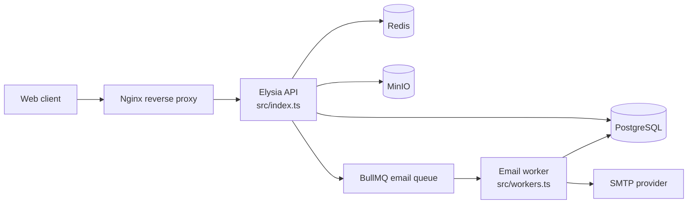

# Architecture

This backend serves the Total Worker Health Promotion (TWHP) system. It is a Bun/TypeScript application with two executable processes:

- an Elysia HTTP API for authentication, enrollment, factory assessments, scoring, review, administration, locations, and file access;
- a BullMQ worker for transactional and scheduled email.

PostgreSQL is the durable system of record. Redis holds queue data and temporary authentication state. MinIO stores uploaded evidence and certificate files; PostgreSQL stores their filenames.

For code navigation, see [Project structure](project-structure.md). For behavior and data details, see [Domain model](domain-model.md), [Business rules](business-rules.md), [Database](database.md), and [Authentication and authorization](authentication-authorization.md).

## System at a glance



| Concern | Implementation | Authoritative source |
|---|---|---|
| Runtime and package manager | Bun with strict TypeScript | `package.json`, `bun.lock`, `tsconfig.json` |
| HTTP framework | Elysia with filesystem autoload | `src/index.ts`, `src/routes/` |
| Validation and OpenAPI | Elysia TypeBox and `@elysiajs/openapi` | `src/schema/`, route files |
| Persistence | Drizzle ORM with PostgreSQL | `src/drizzle/index.ts`, `src/drizzle/schema.ts` |
| Authentication | Cookie JWT, refresh rotation, staff email OTP | `src/middleware/jwt.ts`, `src/service/authentication.ts` |
| Authorization | Role-specific Elysia guards | `src/middleware/rbac.ts`, `src/middleware/guards.ts` |
| Object storage | MinIO | `src/utils.ts` |
| Jobs and temporary state | BullMQ and Redis | `src/queue/email.ts`, `src/workers.ts` |
| Email | Nodemailer in a separate worker | `src/worker/email.ts` |
| Logging | `@bogeychan/elysia-logger`; console logging remains in worker/utilities | `src/index.ts`, `src/worker/email.ts` |

The checkout lockfile fixes current dependency resolution. The exact production Bun runtime is **Unknown / Requires Organizational Knowledge**: Docker uses the floating `oven/bun:1` family, while `elysia` and `bun-types` are declared as `latest`.

## Process composition

### API process

`src/index.ts` is the API composition root used by `bun run dev`, `bun run start`, Docker Compose, and the release image. Startup proceeds as follows:

1. Import `src/config.ts`, which eagerly validates configuration.
2. Create the structured logger.
3. Create `new Elysia({ prefix: "/twhp/api" })`.
4. Mount OpenAPI at `/twhp/api/document`.
5. Install request logging and global error hooks.
6. Autoload `src/routes/`, ignoring test/spec files.
7. Listen on `APP_PORT` with a 130 MB request-body limit.

`src/routes/index.ts` supplies `/twhp/api/health`. This is a liveness response only: it returns a constant string and does not check PostgreSQL, Redis, MinIO, SMTP, or the worker.

The release image deliberately runs the API from TypeScript source. `elysia-autoload` needs the route filesystem at runtime, so `Dockerfile` copies `src/` rather than compiling the API into a standalone binary.

### Worker process

`src/workers.ts` is the worker composition root used by `bun run worker`. Importing `src/worker/email.ts` creates the BullMQ worker as a module side effect. The process consumes these `email` queue job names:

- `password-reset-request`
- `factory-validation-reminder`
- `2fa-otp`
- `verdict-result-finished`
- `verdict-result-in-progress`

The bootstrap also registers `factory-validation-reminder` with cron pattern `30 8 * * *`. The pattern has no explicit timezone. Its intended 08:30 Bangkok execution relies on the worker process environment; Compose sets `TZ=Asia/Bangkok`. Any non-Compose launch must preserve that invariant.

Worker replica count, repeat-job ownership, job replay, delivery monitoring, and dead-letter procedures are **Unknown / Requires Organizational Knowledge**.

## Module organization and dependency direction

The intended per-domain flow is:

```text
route + TypeBox contract
        -> domain service
        -> Drizzle tables/PostgreSQL
```

Routes under `src/routes/` are HTTP adapters. They attach guards, declare request/response schemas, call service singletons, and pass service results back to Elysia. DTOs live under `src/schema/`. Business workflows and Drizzle queries live together under `src/service/`.

Most database services expose a factory and a production singleton:

```ts
export const createXxxService = (database: typeof db) => ({ /* ... */ });
export const xxxService = createXxxService(db);
```

This is a useful database seam, but it is **not full dependency injection**. Do not assume `createXxxService(testDb)` isolates the complete module:

- `createAuthenticationUsecase(database)` still uses global `redisConnector`, `emailQueue`, and `env`.
- `createEvaluatorReviewService(database)` still uses global `emailQueue`, MinIO utilities, and the production `evaluatorService` singleton when resolving evaluators.
- answer, enrollment, and file services use process-global MinIO helpers; cover, factory, and score use the fiscal-year helper exported by the same overloaded global utilities module.

Services also return Elysia `status(...)` objects, and routes detect `ElysiaCustomStatusResponse`. The business layer is therefore coupled to the HTTP framework. `src/service/scoreHelpers.ts` is the notable pure module: it contains scoring and grade computation without Elysia or infrastructure imports.

For known maintainability consequences, see [Technical debt](technical-debt.md).

## Request lifecycle

A typical guarded request follows this path:

1. Nginx proxies `/twhp/api/` to the API in container deployments.
2. Elysia logging captures request metadata.
3. Filesystem routing and TypeBox validation select and validate the handler.
4. `jwtPlugin` verifies the `Authentication` cookie. If necessary, it uses the `Refresh` cookie to rotate tokens, update cookies, and possibly update the persisted refresh-token hash.
5. `requireRoles` or a precomposed guard checks the JWT role.
6. The route calls one or more service singletons.
7. The service queries PostgreSQL and may use Redis, BullMQ, or MinIO.
8. Elysia validates/serializes the response. Global hooks normalize and log framework errors or log custom 4xx responses.

Refresh rotation is write-capable middleware: an otherwise read-only endpoint may update authentication cookies and account refresh-token state.

The precomposed guards in `src/middleware/guards.ts` are:

| Guard | Allowed role |
|---|---|
| `adminGuard` | `DOED` |
| `factoryGuard` | `Factory` |
| `evalGuard` | `Evaluator` |
| `officerGuard` | `Provincial` |

See [API conventions](api-conventions.md) for route and response conventions and [Authentication and authorization](authentication-authorization.md) for token, OTP, and role behavior.

## State and consistency boundaries

### PostgreSQL state

`src/drizzle/schema.ts` declares all tables and enums. Services query these declarations directly; there is no separate repository layer.

Current cover and answer state follows a load-bearing latest-log-wins convention:

- cover state comes from the latest `coverLogs` row;
- answer state comes from the latest `answerLogs` row;
- missing logs receive workflow-specific default states.

This query convention is implemented in several services rather than one shared module. Changes to log ordering or defaults must be checked across `cover.ts`, `answer.ts`, `enroll.ts`, `score.ts`, and `evaluator-review.ts`.

Scores and grades are derived on demand. They are not persisted. See [Business rules](business-rules.md) and ADR [0001](adr/0001-score-calculated-on-demand.md).

### PostgreSQL and MinIO

MinIO operations intentionally occur outside database transactions. This avoids holding a database connection during file I/O, but the systems are not atomic:

- an upload can succeed before a later database write fails, leaving an orphan object;
- replacement code can delete an old object before replacement upload/database update succeeds;
- non-strict deletion can fail while database work continues;
- strict multi-file deletion can partially succeed before another deletion aborts finalization.

Treat compensation and reconciliation as part of every file-changing workflow. See [Troubleshooting](troubleshooting.md) for operational recovery guidance.

### PostgreSQL, Redis, and email jobs

Queue publication is not transactional with PostgreSQL or Redis state:

- evaluator finalization commits before it publishes a result email, and enqueue failure is logged without rolling back finalization;
- OTP challenge keys are written before the email job is published, so challenge state can exist without successful delivery.

There is no transactional outbox in the current source.

## Shared infrastructure and lifecycle

These objects are created at module import and live for the process lifetime:

| Object | Source |
|---|---|
| validated `env` | `src/config.ts` |
| Drizzle `db` | `src/drizzle/index.ts` |
| MinIO client and Redis singleton | `src/utils.ts` |
| BullMQ queue | `src/queue/email.ts` |
| production service singletons | `src/service/*.ts` |
| JWT and role guard plugins | `src/middleware/*.ts` |
| BullMQ worker and Nodemailer transporter | `src/worker/email.ts` |

Importing a route or service can therefore create network clients transitively. No explicit graceful-shutdown hook closes these resources in `src/index.ts` or `src/workers.ts`.

`src/utils.ts` imports `ioredis` directly, but `package.json` does not declare it directly. The checkout currently receives it transitively; maintainers should not treat that as a stable dependency contract.

## Configuration

Configuration is mostly centralized in `src/config.ts`. Importing it eagerly parses required numbers/booleans and fails startup on missing or malformed values. It covers database, API, JWT/cookies, Redis, SMTP, frontend, OTP, development bypass, and MinIO settings.

Exceptions are tooling entry points:

- `drizzle.config.ts` imports validated config but passes `process.env.DATABASE_URL` to Drizzle Kit;
- `src/drizzle/seed.ts` reads `process.env.DATABASE_URL` directly;
- Nginx-only variables are consumed by `nginx/nginx.conf.template`, outside application config.

`SMTP_STARTTLS` and `SMTP_SECURE` are required and validated but are not passed to `nodemailer.createTransport` in current source.

Canonical deployed values, secret storage, Redis security settings, and environment ownership are **Unknown / Requires Organizational Knowledge**. See [Development](development.md) and [Deployment](deployment.md) for command- and environment-level guidance.

## Logging and operational visibility

The API uses structured request/error logging with Bangkok-local timestamps. It records method, URL, content type, authorization-header presence, forwarded IP, and user agent; the health route is excluded from automatic request logs. Expected parse/validation errors become 400, framework not-found errors become 404, and unexpected errors become generic 500 responses.

Worker delivery, MinIO deletion, some service fallback, seed, and startup paths still use `console.log`/`console.error`. No metrics, tracing, request correlation ID, BullMQ event monitoring, or dependency-aware readiness check exists in source.

The production log aggregation, alerting, metrics, tracing, and health-check ownership are **Unknown / Requires Organizational Knowledge**.

## Build and deployment shape

There is no general application build script. `Dockerfile` is the release packaging path:

- dependencies are installed with `bun install --frozen-lockfile`;
- the worker is compiled to `worker-bin`;
- the API source, dependencies, Drizzle config, and seed inputs are copied into the runtime image;
- the default image command runs `bun src/index.ts`.

`docker-compose.yaml` supplies development, staging, and production profiles with API, worker, PostgreSQL 17, Redis 7, MinIO, and Nginx services.

The `migrate-prod` service is intentionally a **no-op**. It prints a warning that production data/schema changes are imported manually. The owner, procedure, validation, rollback, and recovery steps for that process are **Unknown / Requires Organizational Knowledge** and must be established before production changes.

Production uses floating application image tags in this repository. Image publication, deployment, replica counts, rollback, backups, and disaster recovery are also **Unknown / Requires Organizational Knowledge**. See [Deployment](deployment.md).

## Architectural invariants

Before changing cross-cutting behavior, preserve or explicitly revise these invariants:

1. All HTTP routes live under `/twhp/api` and are registered through `src/routes/` autoload.
2. `src/drizzle/schema.ts` is the single database schema declaration.
3. Latest log rows determine current cover/answer state.
4. Scores and grades are calculated on demand.
5. Standard enum keys, enrollment columns, service mappings, DTOs, and seed data must remain aligned.
6. File I/O stays outside database transactions and therefore requires failure compensation.
7. API and Nginx request-body limits both currently allow 130 MB.
8. The daily worker schedule requires Bangkok process timezone.
9. Service factories inject a database, not every external dependency.

## Evidence status

Architecture, bootstrap, imports, scripts, and container definitions above are verified from current source and configuration. Failure outcomes described across separate systems are reasoned from operation ordering and should be fault-injection tested before remediation. Deployed runtime versions and all organization-owned operational procedures are explicitly unknown.
