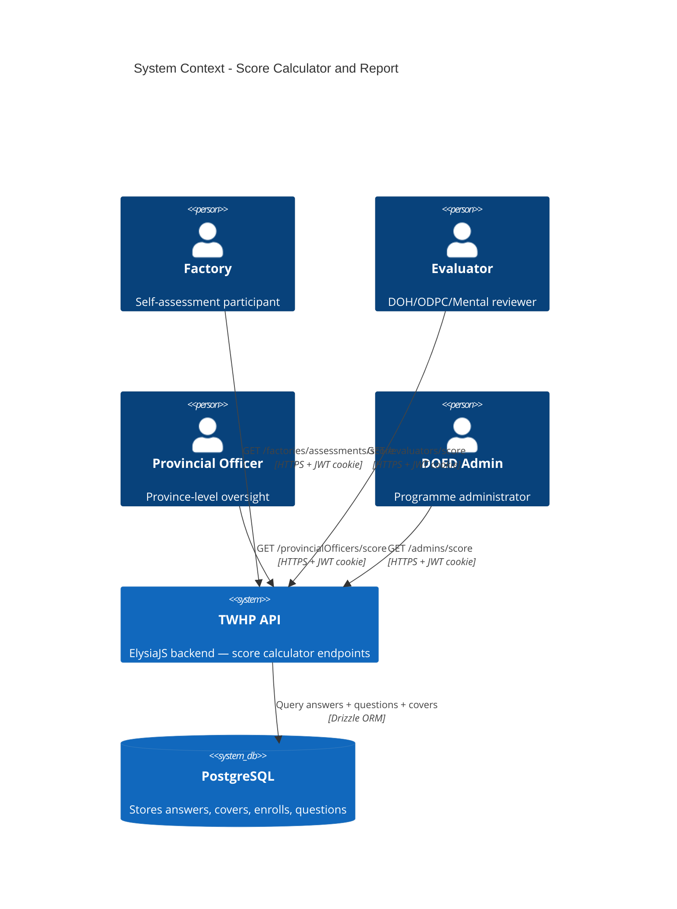

# System Context: Score Calculator and Report

## Actors

| Actor | Type | Description |
|-------|------|-------------|
| **Factory** | Human | Submits self-assessment answers; reads their own score after submission |
| **Evaluator** | Human | Reviews covers for factories in their health region; reads region-wide scores |
| **Provincial Officer** | Human | Oversees factories in their province; reads province-wide scores |
| **DOED Admin** | Human | Oversees entire programme; reads all scores with optional region/province filter |

## External Systems

| System | Direction | Data Exchanged | Protocol |
|--------|-----------|---------------|----------|
| **PostgreSQL** | Inbound | Answers, Questions, Covers, Enrolls, Factories, Provinces | Drizzle ORM (SQL) |
| **JWT Auth (cookie)** | Inbound | Identity + Role from `Authentication` cookie | HTTP cookie / HMAC |

No outbound external integrations — score is read-only, no webhooks or notifications.

## Data Flows

### Inbound

- Authenticated HTTP GET request with `Authentication` cookie
- No request body (all GET endpoints)
- Factory endpoint: no params (identity from JWT)
- Evaluator/Provincial endpoints: no params (scope from JWT-derived profile)
- Admin endpoint: optional `?region=` and `?provinceId=` query params

### Outbound

- JSON Score Report: `{ factoryId, factoryNameTh, coverId, coverStatus, enrollId, totalScore, collaborate, disease, safety, mental, outcome }`
- Single object (Factory endpoint) or array of objects (Evaluator, Provincial, Admin endpoints)
- All score values are rounded integers (0–100)

## System Context Diagram

