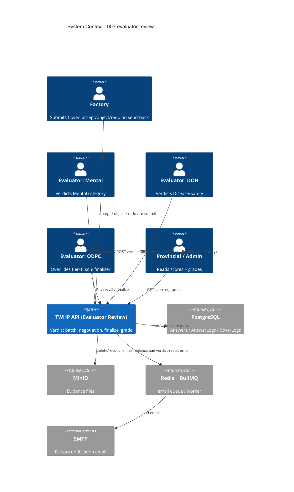

# System Context: 003-evaluator-review

The feature lives inside the existing TWHP ElysiaJS monolith (`/twhp/api`). It adds evaluator-facing review endpoints and factory-side response actions on top of the existing Cover/Answer/AnswerLog/CoverLog model. It introduces no new external system — it reuses the same Postgres, MinIO, Redis/BullMQ, and SMTP already in the stack.

## Actors

| Actor | Type | Interaction |
|-------|------|-------------|
| **Factory account** | Human (external) | Submits the Cover; on send-back, **accepts**/**objects**/**redoes** Answers; re-submits. Sees only its own Cover. |
| **Evaluator — Mental** | Human (staff) | Reviews/verdicts `Mental` answers only. Non-finalizing. |
| **Evaluator — DOH** | Human (staff) | Reviews/verdicts `Disease`+`Safety` answers only. Non-finalizing. |
| **Evaluator — ODPC** | Human (staff) | Reviews all categories, overrides tier-1, **sole finalizer** (writes `finished`, transitions Cover, computes Grade). |
| **Provincial Officer / Admin (DOED)** | Human (staff) | Read scores/grades across province / all (existing score endpoints, extended with `grade`). |
| **BullMQ email worker** | System (internal) | Consumes the new verdict-result email job(s) on ODPC commit. |

## External Systems (all pre-existing — no new dependency)

| System | Direction | Data Exchanged | Protocol | Risk |
|--------|-----------|----------------|----------|------|
| **PostgreSQL** (Drizzle) | Both | Answers, AnswerLogs (`+verdict_choice`, `answerStatus +recommended`), CoverLogs, Covers, Enrolls, Evaluators | SQL/txn | High (correctness of event-sourced state) |
| **MinIO** | Both | Evidence files — delete on hard-reject (at ODPC commit), reconcile on factory object/redo | S3 API | Medium (must run outside DB txn) |
| **Redis + BullMQ** (`email` queue) | Outbound | New verdict-result job(s): "complete + Grade" / "revision needed" | Queue | Medium (shared login-critical worker — ADR-0002) |
| **SMTP** | Outbound | Factory notification email (via `enrolls.email`) | SMTP | Low |

## Data Flows

### Inbound (into the feature)
- **Evaluator verdict batch** — `POST …/evaluators/covers/:coverId/verdict` `{ answerId, decision: approve|change_score|reject, verdictChoice?, description? }[]`. Validated: out-of-scope category → `403`; `change_score` needs `verdictChoice` 0–3 + `description`; `reject` needs `description`.
- **Evaluator answer read** — `GET …/evaluators/covers/:coverId/answers` (category-filtered by caller level).
- **Factory response** — accept / object / redo on `rejected` Answers, via existing factory answer endpoints (object/redo carry files).

### Outbound (out of the feature)
- **Cover/Answer state transitions** — `answerLogs` + `coverLogs` rows (single transaction per ODPC commit). Only ODPC writes the `coverLogs` transition and `finished`.
- **MinIO deletes** — for hard-rejected Answers, at ODPC commit, before the txn.
- **Email job enqueue** — one factory email per ODPC commit (both `finished` and `in_progress`).
- **Grade** — returned in the finalize response and exposed via the (extended) Score Report.

## Boundaries & Non-Goals
- **No new external system**; reuses the existing stack.
- **No new score endpoint** (ADR-0001) — the existing factory/evaluator/provincial/admin score endpoints gain a `grade` field.
- **No concurrency-locking apparatus** — single-finalizer (ODPC) + factory-never-holds-Cover-while-evaluator-acts dissolves the races (ADR-0003).
- **Out of scope**: escalation/deadline for a never-settling negotiation loop (future ADR); 2FA/auth (intent 002).

## Context Diagram

