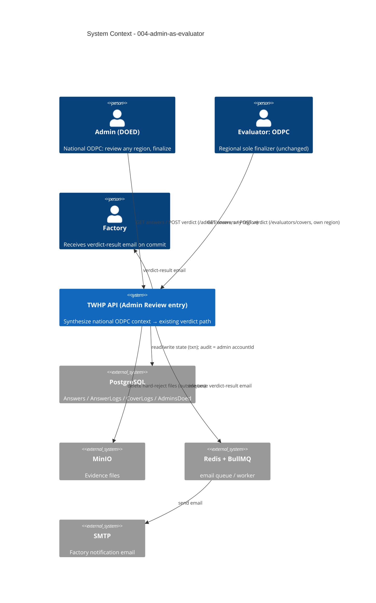

# System Context: 004-admin-as-evaluator

The feature lives inside the existing TWHP ElysiaJS monolith (`/twhp/api`). It adds an
**admin-facing entry point** (`/admin/covers/*`, under `adminGuard`) into the
already-defined `003-evaluator-review` flow. It introduces **no new external system**
and **no schema change** — it reuses the same Postgres, MinIO, Redis/BullMQ, and SMTP,
and the same `evaluatorReviewService` ODPC code path. The only new behaviour is mapping
a DOED admin to a **synthesized national ODPC reviewer context**.

## Actors

| Actor | Type | Interaction |
|-------|------|-------------|
| **Admin (DOED)** | Human (staff) | NEW: enters the review flow at `/admin/covers/*` as a **national ODPC** — lists answers across any region, submits the finalizing verdict batch (override/backstop/finalize), triggers Grade + factory email. |
| **Evaluator — ODPC** | Human (staff) | Unchanged: regional sole finalizer at `/evaluators/covers/*`. Admin mirrors its powers, nationally. |
| **Factory account** | Human (external) | Unchanged: submits/accepts/objects/redoes; receives the verdict-result email on the admin's commit exactly as on an ODPC commit. |
| **BullMQ email worker** | System (internal) | Unchanged: consumes the existing `verdict-result-*` jobs the admin commit enqueues. |

## External Systems (all pre-existing — no new dependency, no schema change)

| System | Direction | Data Exchanged | Protocol | Risk |
|--------|-----------|----------------|----------|------|
| **PostgreSQL** (Drizzle) | Both | Answers, AnswerLogs (`evaluation_id` ← admin `accountId`), CoverLogs (`evaluator_id` ← admin `accountId`), Covers, Enrolls; **AdminsDoed** (caller identity) | SQL/txn | Medium (correct audit + reuse of ODPC txn) |
| **MinIO** | Both | Hard-reject evidence deletes at admin commit, outside the txn (reused 003 path) | S3 API | Medium |
| **Redis + BullMQ** (`email` queue) | Outbound | Existing `verdict-result-finished` / `verdict-result-in-progress` jobs | Queue | Low (no new job type) |
| **SMTP** | Outbound | Factory verdict-result email | SMTP | Low |

## Data Flows

### Inbound (into the feature)
- **Admin answer read** — `GET …/admin/covers/:coverId/answers` (no region filter; ODPC ownership = all 5 categories).
- **Admin verdict batch** — `POST …/admin/covers/:coverId/verdict` `{ answerId, decision: approve|change_score|reject, verdictChoice?, description? }[]` (same `VerdictBatchSchema`).

### Outbound (out of the feature)
- **Cover/Answer state transitions** — `answerLogs` + `coverLogs` rows in the single ODPC commit transaction; `evaluation_id` / `evaluator_id` carry the **admin `accountId`**.
- **MinIO deletes** — hard-rejected Answers, at commit, before the txn (reused).
- **Email job enqueue** — one factory email per admin commit (reused jobs).
- **Grade** — returned in the finalize response (on-demand, reused).

## Boundaries & Non-Goals
- **No new external system, no schema/migration, no new enum/column** — audit reuses the existing non-FK `evaluation_id` / `evaluator_id` integers.
- **No new review semantics** — the admin path drives the *existing* ODPC branch; it adds only the entry point + reviewer-context synthesis.
- **No superset powers** — admin == ODPC exactly (no override of `finished`, no "act when no ODPC present" escape).
- **Out of scope**: distinguishing admin vs ODPC in logs/email (PO: not needed); locking for the admin+ODPC two-finalizer edge (accepted, future ADR if contention appears); intent 002/003 work themselves.

## Context Diagram

