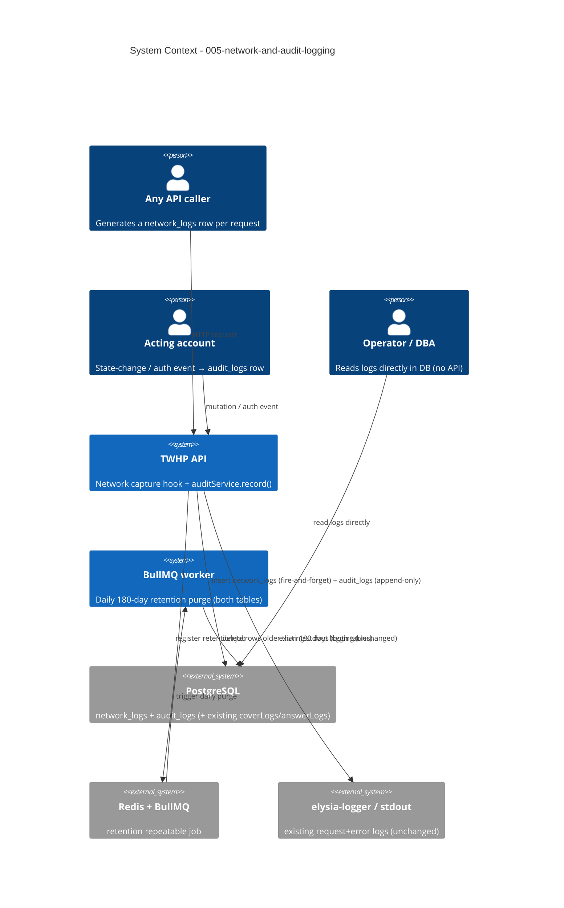

# System Context: 005-network-and-audit-logging

This intent is a **cross-cutting infrastructure capability** inside the existing TWHP
ElysiaJS monolith (`/twhp/api`). It adds **two persisted log tables** and the pipelines
that fill them, plus a worker-side retention job. It introduces **no new external system**:
it reuses the existing PostgreSQL (Drizzle), Redis/BullMQ, and the `@bogeychan/elysia-logger`
stdout pipeline already wired in `src/index.ts`. The existing `coverLogs` / `answerLogs`
status-history tables are **unchanged and retained**.

## Actors

| Actor | Type | Interaction |
|-------|------|-------------|
| **Every API caller** (Factory / Provincial / Evaluator / DOED / anonymous) | Human + System | Implicitly generates a `network_logs` row per request (one row per request, health excluded). Not a new user-facing action. |
| **Acting staff/factory account** | Human | State-changing actions and auth events they perform are recorded as attributed `audit_logs` rows (who/what/when/outcome). |
| **BullMQ worker** | System (internal) | NEW repeatable daily job purges rows older than 180 days from **both** tables; runs in the `bun run worker` process. |
| **Operator / DBA** | Human (internal) | Reads the logs **directly in the DB** — no API surface is exposed this intent. |

## External Systems (all pre-existing — no new dependency)

| System | Direction | Data Exchanged | Protocol | Risk |
|--------|-----------|----------------|----------|------|
| **PostgreSQL** (Drizzle) | Both | NEW `network_logs` + `audit_logs` inserts (write-heavy for network); retention deletes; reads of existing accounts/role for attribution | SQL | Medium (write volume on hot path — must be non-blocking) |
| **Redis + BullMQ** | Both | NEW daily retention repeatable job (reuses the queue/worker mechanism in `src/workers.ts`) | Queue | Low |
| **`elysia-logger` / stdout** | Outbound | Existing request/error stdout logging continues unchanged; the network-log capture sits alongside it | pino | Low |

## Data Flows

### Inbound (into the feature)
- **Every HTTP request** → captured by the global Elysia lifecycle (alongside the existing
  `logger()` plugin in `src/index.ts`) → one `network_logs` row (method, path, status,
  latency, ip, user-agent, `account_id` from `jwtPayload.sub` if present). `/health` excluded.
- **Every state-changing service operation + auth event** → an explicit
  `auditService.record(...)` call at the mutation/auth site → one `audit_logs` row
  (actor, action, entity, outcome, metadata).

### Outbound (out of the feature)
- **`network_logs` inserts** — fire-and-forget; failures swallowed-and-logged, never alter
  the HTTP response.
- **`audit_logs` inserts** — append-only; preferably written within the owning domain
  transaction where one exists, but never blocking its success path.
- **Retention deletes** — daily worker job removes rows older than 180 days from both tables.

### Explicitly NOT a flow (this intent)
- **No read/query/export API** for either log (FR-9). Inspection is direct-DB only.

## Boundaries & Non-Goals
- **No new external system, no new public endpoint.** Two new Drizzle tables + capture
  pipelines + one worker job only.
- **No replacement of `coverLogs` / `answerLogs`** — `audit_logs` is additive and
  cross-cutting (covers auth, enroll, score actions those tables never recorded).
- **No secrets persisted** — no token/password/OTP/raw `Authorization` value; preserve the
  existing `authorization`-as-boolean behaviour (`src/index.ts:28`). No request/response
  bodies stored.
- **Logging must never fail a business operation** — writes are isolated from the response path.
- **Out of scope**: read/query endpoints, dashboards, alerting, external log shipping
  (Loki/ELK), per-table retention windows, request/response body capture.

## Context Diagram

