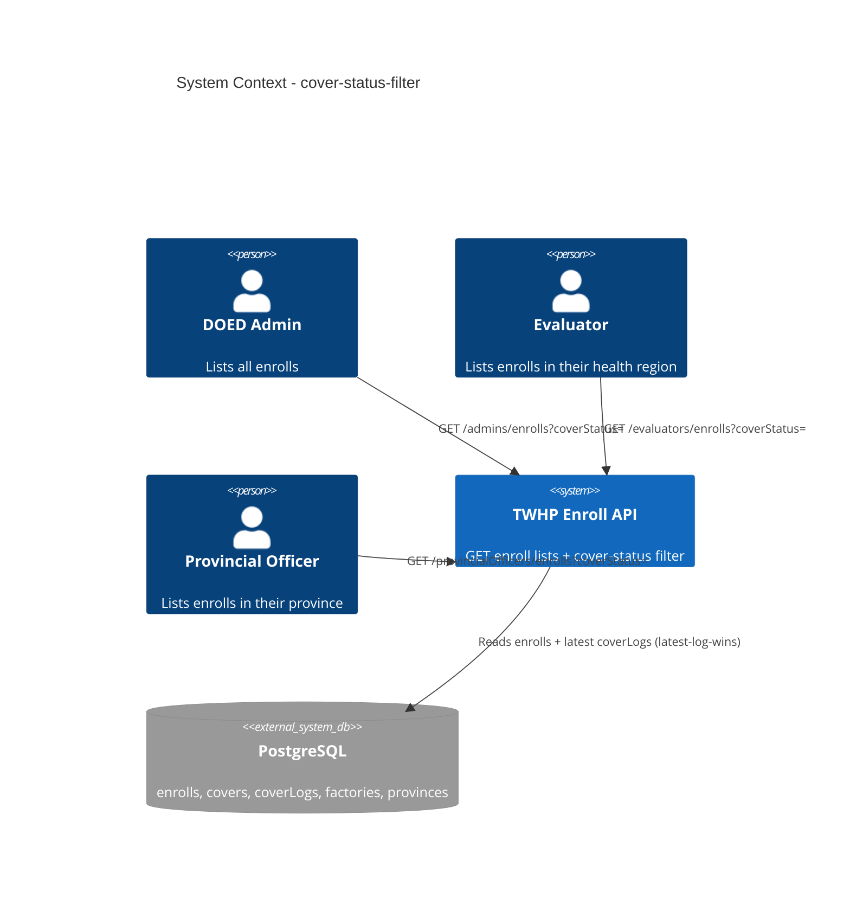

# Cover Status Filter - System Context

## System Overview

A read-only enhancement to the TWHP enroll-listing API. Three existing staff
endpoints (`GET /admins/enrolls`, `GET /evaluators/enrolls`,
`GET /provincialOfficers/enrolls`) gain an optional `coverStatus` query filter and
return each enroll enriched with its cover's `coverId` + `coverStatus`. No new
tables, no writes — it joins the existing `covers`/`coverLogs` data already
produced by the assessment/verdict flows.

## Context Diagram

## External Integrations

- **PostgreSQL (Drizzle)**: Source of `enrolls`, `covers`, `coverLogs`,
  `factories`, `provinces`. Cover status is the latest `coverLogs` row per cover.
- No third-party services, queues, or file storage involved (pure read path).

## High-Level Constraints

- Reuse existing auth guards (`adminGuard`, `evalGuard`, `officerGuard`) — no auth change.
- Reuse `utilities().getFiscalYear()` for fiscal-year scoping.
- Additive only: existing enroll-list consumers must keep working unchanged.

## Key NFR Goals

- No N+1: enrichment uses ≤ 2 bounded queries over the enroll set
  (mirrors `score.ts buildScoreReports`).
- Behaviour-preserving when `coverStatus` is absent.
