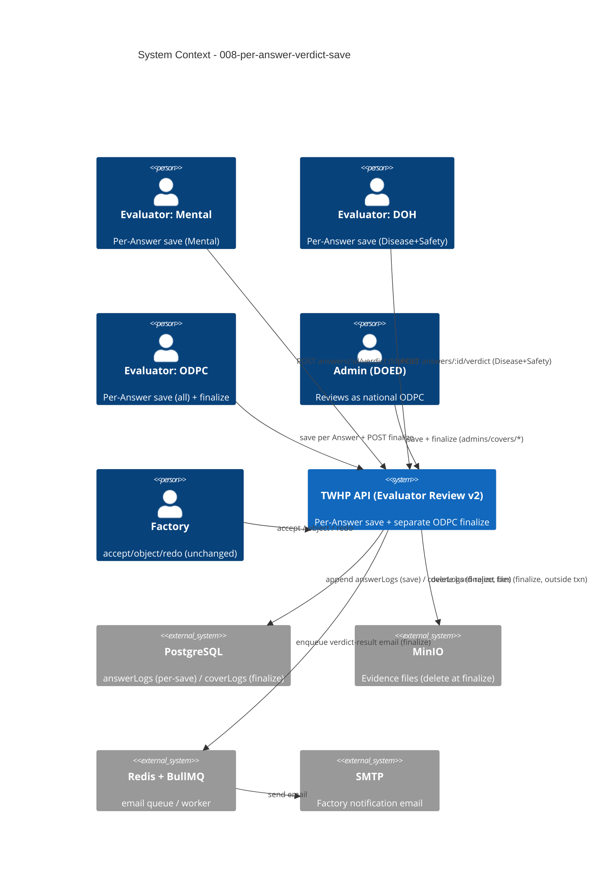

# System Context: 008-per-answer-verdict-save

A **brown-field** change inside the existing TWHP ElysiaJS monolith (`/twhp/api`), refactoring the write path of intent `003-evaluator-review`. It replaces the single batch verdict endpoint with a per-Answer save endpoint and a separate ODPC finalize endpoint. It introduces **no new external system** and **no schema migration** — the same Postgres/`answerLogs`, MinIO, Redis/BullMQ, and SMTP already in the stack are reused, with the same aggregate (`answers`/`answerLogs`/`coverLogs`).

## Actors

| Actor | Type | Interaction (changed vs. 003) |
|-------|------|-------------------------------|
| **Evaluator — Mental** | Human (staff) | Saves verdicts **per Answer** on `Mental` only; may re-edit own non-`finished` verdicts while Cover `in_review`. Non-finalizing. |
| **Evaluator — DOH** | Human (staff) | Saves verdicts per Answer on `Disease`+`Safety` only. Non-finalizing. |
| **Evaluator — ODPC** | Human (staff) | Saves verdicts per Answer on all categories (approve → `recommended`, revocable), then calls **finalize** (separate action) — the sole writer of `finished` and the only Cover transition. |
| **Admin (DOED)** | Human (staff) | Reviews **as national ODPC** (`adminReviewerContext`, region null) via the mirrored `admins/covers/*` surface: same per-Answer save + finalize. |
| **Factory account** | Human (external) | Unchanged — accept/object/redo on `rejected` Answers via existing factory endpoints; sees results only after finalize bounces/finishes the Cover. |
| **BullMQ email worker** | System (internal) | Unchanged — consumes the verdict-result email job, now enqueued only at finalize. |

## External Systems (all pre-existing — no new dependency)

| System | Direction | Data Exchanged | Protocol | Risk |
|--------|-----------|----------------|----------|------|
| **PostgreSQL** (Drizzle) | Both | `answerLogs` (one row per save — **no schema change**), `coverLogs` (transition at finalize only), `covers`, `enrolls`, `evaluators` | SQL/txn | High (event-sourced correctness across N saves + finalize) |
| **MinIO** | Outbound | Evidence deletes for hard-rejected Answers — **only at finalize**, outside the txn | S3 API | Medium (must stay deferred; save does zero I/O) |
| **Redis + BullMQ** (`email` queue) | Outbound | Verdict-result job ("complete + Grade" / "revision needed") — enqueued only at finalize | Queue | Low (unchanged surface) |
| **SMTP** | Outbound | Factory notification email (via `enrolls.email`) | SMTP | Low |

## Data Flows

### Inbound (into the feature)
- **Per-Answer verdict save** — `POST …/covers/:coverId/answers/:answerId/verdict`, body `{ decision: approve|change_score|reject, verdictChoice?, description? }` (single entry; `answerId` in path). Validated: out-of-scope category → `403`; edit guard (`finished`→`400`, `recommended`→author/ODPC else `403`); `change_score` needs `verdictChoice` 0–3 + `description` and must differ from live choice; `reject` needs `description`.
- **ODPC finalize** — `POST …/covers/:coverId/finalize`, empty body, ODPC/admin only (tier-1 → `403`).
- **Evaluator answer read** — `GET …/covers/:coverId/answers` (unchanged; the resume source).
- **Factory response** — accept/object/redo (unchanged).

### Outbound (out of the feature)
- **Per-Answer state** — one `answerLogs` row per save; **no** `coverLogs` write, MinIO I/O, or email during the save phase.
- **Cover transition** — a single `coverLogs` row written **only** by finalize; only finalize writes `finished`.
- **MinIO deletes** — hard-rejected Answers, at finalize, before the txn.
- **Email + Grade** — one factory email per finalize; Grade in the finalize response + Score Report (unchanged).

## Boundaries & Non-Goals
- **No new external system**, **no schema migration** — `answerStatus` and all tables unchanged.
- **No concurrency-locking apparatus** — single-finalizer property preserved (ADR-0003); no new concurrent writers.
- **Out of scope**: admin force-status/override endpoint (ADR-0004 defers escalation/override); "un-verdict" revert to `in_review`; any change to the negotiation loop, grading, or email content.

## Context Diagram

