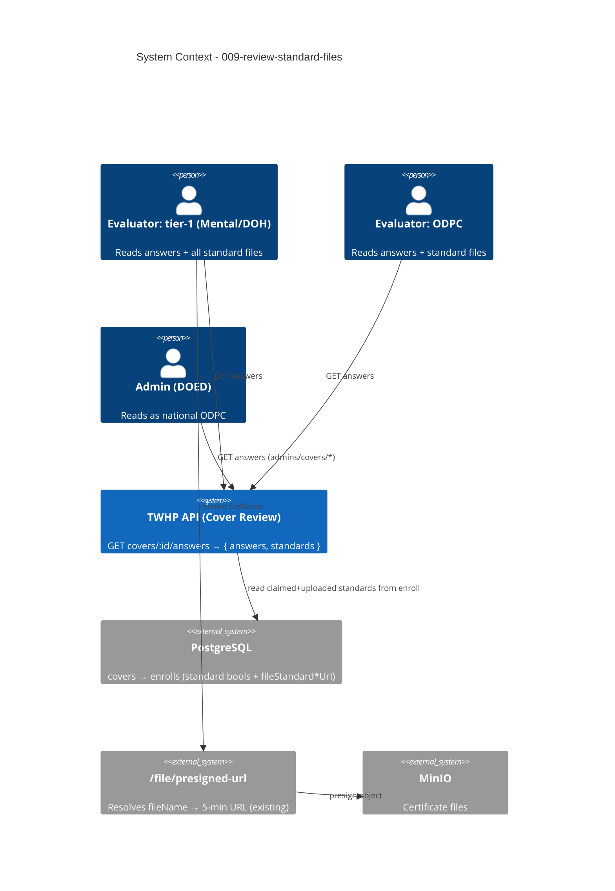

# System Context: 009-review-standard-files

A **brown-field, read-only** enrichment inside the existing TWHP ElysiaJS monolith (`/twhp/api`). It extends the cover-review read (`GET …/covers/:coverId/answers`, delivered by `008-per-answer-verdict-save` bolt 021) so the response also carries the factory's **claimed + uploaded** standard certificate files from the cover's `enrolls` row. **No new external system, no schema migration, no new mutation.** The only behavioural change is the response **shape** (`array` → `{ answers, standards }`) and the added `standards` collection.

## Actors

| Actor | Type | Interaction |
|-------|------|-------------|
| **Evaluator — Mental / DOH (tier-1)** | Human (staff) | Reads the cover-review answers (category-scoped) and now **also sees all** of the factory's claimed standard certificate files (factory-level, not category-scoped). |
| **Evaluator — ODPC** | Human (staff) | Same read on all categories + standards. |
| **Admin (DOED)** | Human (staff) | Reviews as national ODPC (`admins/covers/*`, region null) — same answers + standards payload. |
| **`/file` presigned-URL endpoint** | System (internal) | Unchanged — reviewers resolve each returned `fileName` to a 5-minute presigned URL (jwt-guarded). |

## External Systems (all pre-existing — no new dependency)

| System | Direction | Data Exchanged | Protocol | Risk |
|--------|-----------|----------------|----------|------|
| **PostgreSQL** (Drizzle) | Inbound (read) | `covers → enrolls` join; read `standard*` booleans + `fileStandard*Url` filenames (**no schema change**) | SQL | Low (read-only, one extra join) |
| **MinIO** | (indirect) | Certificate files are fetched later via the existing `/file/presigned-url`, **not** in this call | S3 API | Low (unchanged; no presigning in `/answers`) |

## Data Flows

### Inbound (into the feature)
- **Cover-review read** — `GET …/covers/:coverId/answers` on both `evaluators/covers/*` and `admins/covers/*`. Cover access is gated by the existing `assertCoverAccess` (region-scoped / national). Answers filtering (region + category) is unchanged.

### Outbound (out of the feature)
- **Response** — `{ answers: AnswerViewItem[], standards: StandardFileItem[] }`.
  - `answers`: the exact prior array, unchanged, moved under the `answers` key.
  - `standards`: `{ standard, fileName }[]` — one item per standard the factory **claimed** (`standard*=true`) **and** uploaded (`fileStandard*Url` not null); `standard` = the `standardTypes` enum key; `fileName` = the stored filename (resolved later via `/file`).

## Boundaries & Non-Goals
- **No new external system**, **no schema migration** — `enrolls` standard columns already exist.
- **Read-only** — no new upload/mutation; the enrollment upload flow is untouched.
- **Not category-scoped** — standards are factory-level; every reviewer with cover access sees all claimed standards.
- **Out of scope**: standard label/i18n (frontend owns Thai/EN); inline presigning in `/answers`; surfacing claimed-but-unuploaded gaps (omitted — see requirements Open Questions); any change to answers filtering, verdict save, or finalize.

## Context Diagram

