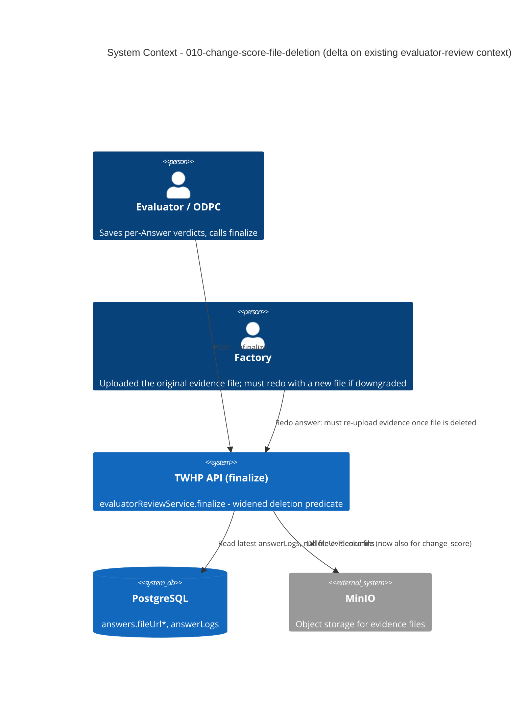

# Change-Score File Deletion - System Context

## System Overview

No new actors, external systems, or boundaries. This intent operates entirely inside the existing evaluator-review write path (`evaluatorReviewService.finalize`, intent `003-evaluator-review` / `008-per-answer-verdict-save`). It changes which Answers' evidence files get deleted from the existing MinIO integration at the existing finalize step — it does not add a new integration or actor.

## Context Diagram

## External Integrations

- **MinIO**: Unchanged integration point — same `utilities().deleteFileStrict(url)` call, now invoked for a wider set of Answers (change_score included, not just hard reject).
- **Email queue (BullMQ)**: Unchanged — the "in-progress" vs "finished" email selection in `finalize` is not touched by this intent.

## High-Level Constraints

- Must reuse the existing file-I/O pattern: delete outside and before the DB transaction (`CLAUDE.md`: "File I/O is always done outside DB transactions").
- No schema change — `answers.fileUrl*` and `answerLogs` columns are unchanged.
- No new route — this is a body-less internal predicate change inside the existing `finalize` handler.

## Key NFR Goals

- Deletion failure for any file in the widened set still aborts finalize with `500` before any DB write (existing guarantee, must not regress).
- No behavior change to `coverStatus`/grade resolution or the finalize email selection.
