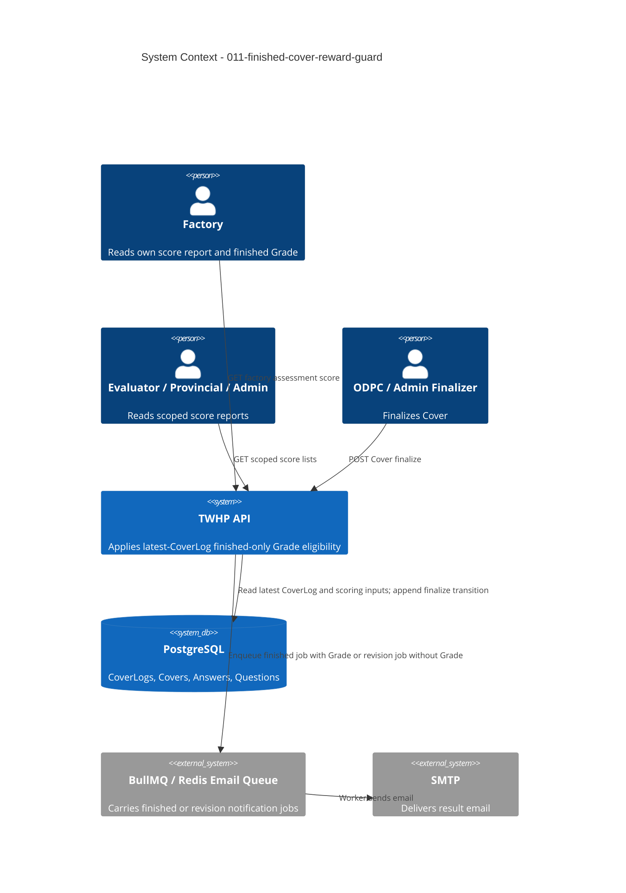

# Finished-Cover Reward Guard - System Context

## System Overview

This intent hardens an existing TWHP assessment rule: a Grade reward is disclosed only when the
Cover's current state—the `CoverLog` with the greatest serial ID—is `finished`. It introduces no new
actor, endpoint, persisted field, or integration. It spans the existing score-report read path and
the existing ODPC/Admin finalize path because both can return or transmit a Grade.

## Actors

- **Factory** (Human/API consumer): Reads its current-fiscal Cover score; receives a Grade only when
  that Cover is finished.
- **Evaluator** (Human/API consumer): Reads regional score reports; sees null Grade for in-review
  Covers and the calculated Grade for finished Covers.
- **Provincial Officer** (Human/API consumer): Reads province-scoped score reports under the same
  finished-only Grade rule.
- **DOED Admin** (Human/API consumer): Reads national score reports and may finalize as national ODPC.
- **ODPC Evaluator** (Human): Finalizes a Cover; a finished result carries Grade, while a revision
  result carries no Grade.
- **Email worker** (System): Delivers an already-selected finalize notification; only the finished
  job payload may contain Grade.

## Context Diagram

## External Integrations

- **PostgreSQL**: Authoritative source of Cover state. Latest-log-wins uses greatest `CoverLogs.id`.
- **BullMQ/Redis**: Existing finalize notification queue; job names and delivery behavior are
  unchanged. Only payload eligibility is protected.
- **SMTP**: Existing outbound delivery boundary; no template or transport change is in scope.

## Data Flows

### Inbound

- Authenticated score-report requests from Factory, Evaluator, Provincial, and Admin routes.
- Authenticated finalize requests from ODPC or Admin-as-ODPC.
- Existing query filters such as region and province; unchanged by this intent.

### Outbound

- Score Reports containing numerical scoring plus `grade: null` for `in_review`, or calculated Grade
  for `finished`.
- Finalize response containing calculated Grade only after the finished CoverLog transition commits.
- Finished email job containing Grade, or revision job containing no Grade.

## High-Level Constraints

- Do not add, remove, or rename endpoints.
- Do not change score availability, formulas, Grade thresholds, authorization, or Cover transitions.
- Do not persist Grade or change the PostgreSQL schema.
- Use CoverLog serial ID ordering, not timestamps.
- Preserve route/service/schema ownership and the shared evaluator/Admin finalize service.

## Key NFR Goals

- Zero non-finished API responses or email payloads with a non-null Grade.
- Identical finished-only eligibility across every reward-producing surface.
- Zero non-Grade API contract regressions.

