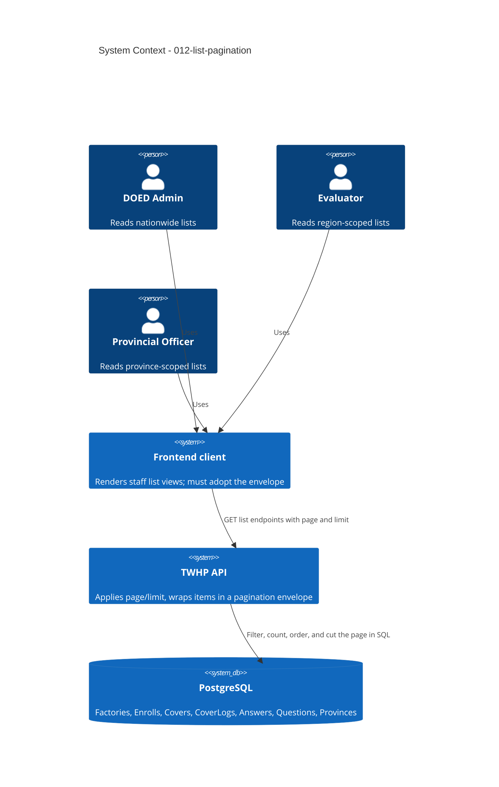

# List Pagination - System Context

## System Overview

This intent bounds the result size of the nine unbounded staff-facing list endpoints of the TWHP
API. It introduces no new actor, no new domain concept, and no persisted field. It changes the
response envelope of those nine endpoints and rewrites two read queries so that filtering happens in
PostgreSQL rather than in JavaScript.

The intent spans three existing read paths — the Factory registry list, the Enrollment list, and the
Score Report list — each of which already exists in three role-scoped variants (DOED Admin,
Evaluator, Provincial Officer). No write path, no Cover transition, and no evaluation rule is
touched.

## Actors

- **DOED Admin** (Human/API consumer): Reads nationwide Factory, Enrollment, and Score Report lists.
  The largest result sets and therefore the primary beneficiary.
- **Evaluator** (Human/API consumer): Reads the same three lists scoped to one health region.
- **Provincial Officer** (Human/API consumer): Reads the same three lists scoped to one province.
- **Frontend client** (System): Consumes all nine endpoints. Must migrate to the new envelope in the
  same release; this is the only actor broken by the change.
- **Factory** (Human/API consumer): Not an actor for this intent. Factory-facing reads are single
  Cover or bounded-collection reads and remain unwrapped arrays.

## Context Diagram

## External Integrations

- **PostgreSQL**: The only integration in scope. Filtering, counting, ordering, and page slicing all
  move into the database. Latest-log-wins continues to use the greatest `CoverLogs.id`, never a
  timestamp.
- **MinIO**: Not in scope. The list endpoints project stored filenames only; no presigned URL is
  generated on these paths.
- **BullMQ/Redis and SMTP**: Not in scope. No list endpoint enqueues a job or sends mail.

## Data Flows

### Inbound

- Authenticated list requests from Admin, Evaluator, and Provincial Officer routes, carrying their
  existing filters: `validated` and `enrolled` for Factory lists, `coverStatus` for Enrollment
  lists, `region` and `provinceId` for the Admin Score Report list.
- Two new optional query parameters on all nine routes: `page` and `limit`.

### Outbound

- A pagination envelope containing the page of items and the pagination metadata
  (`page`, `limit`, `total`, `totalPages`). Item field shapes and casing are unchanged.
- Existing error responses are unchanged and are never wrapped.

## Boundary Decisions

- The envelope applies to these nine endpoints only. It is not a global response wrapper; the
  project standard states the API uses no envelope, and that remains true everywhere else.
- Bounded collections stay unwrapped arrays: the Question set, the per-Cover Answer reads, and the
  location reference lists.
- Bulk export of a full data set is outside this boundary and moves to its own intent.

## High-Level Constraints

- Offset-based pagination, per the project standard. Page numbering starts at 1.
- No endpoint added, removed, or renamed. No database schema change, no Drizzle migration.
- Existing filters, role guards, region and province scoping, and fiscal-year scoping are unchanged.
- The two SQL rewrites must reproduce the current JavaScript filter membership exactly.
- Preserve the service factory plus singleton pattern and the `status(code, body)` return
  convention.

## Key NFR Goals

- No list response exceeds 100 items.
- Answer rows read per Score Report request bounded by the page size, not by the size of the data
  set.
- One count query per list request.
- Zero item fields renamed, recased, or removed across all nine endpoints.
