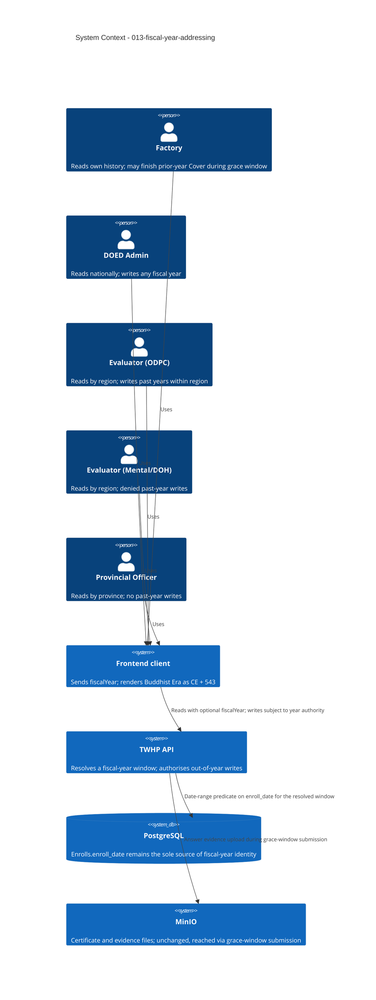

# Fiscal Year Addressing - System Context

## System Overview

This intent makes the fiscal year an explicit dimension of the TWHP API rather than an implicit
property of "now". Today `utilities().getFiscalYear()` (`src/utils.ts:54-64`) derives the current
Oct 1 – Oct 1 window on every request, and sixteen call sites across `enroll`, `cover`, `answer`,
`score`, and `factory` consume it without argument. Nothing can address another year, in either
direction, on any path.

The intent changes three things and nothing else: **reads gain an optional target year**, **two
authorities gain the right to write a closed year**, and **Factories gain a bounded window to finish
work that was already in flight at the boundary**.

It introduces no new persisted field, no new table, no new enum value, and no new index. Fiscal-year
identity continues to be derived from `Enrolls.enroll_date` at query time. That constraint is the
defining property of this intent's design and is recorded as a decision, not an oversight — see
`requirements.md`, "Hard Constraint: No Database Schema Changes".

The immediate driver is a fixed external date: **2026-10-01**. Without this work, on that morning
every role's fiscal-scoped read returns empty or 404, and every Cover left unfinished becomes
permanently unadvanceable.

## Actors

- **Factory** (Human/API consumer): Reads its own history for any fiscal year. Gains a 31-day
  window (2026-10-01 → 2026-10-31 inclusive) in which it may still complete and submit a prior-year
  Cover that has not reached `finished`. The actor this intent primarily exists to protect.
- **DOED Admin** (Human/API consumer, `Role.DOED`): Reads national history. Holds non-expiring
  authority to write any fiscal year.
- **Evaluator — ODPC** (Human/API consumer, `Role.Evaluator` with `evaluators.level = 'ODPC'`):
  Reads region-scoped history. Holds non-expiring authority to write past fiscal years, **within
  its existing region scope**. This is the only actor distinguished by evaluator *level* rather than
  by role, and no current guard can express it.
- **Evaluator — Mental / DOH** (Human/API consumer): Reads region-scoped history. Explicitly
  **denied** past-year writes. Distinguishing them from ODPC is new behaviour.
- **Provincial Officer** (Human/API consumer): Reads province-scoped history. No past-year writes.
- **Frontend client** (System): Sends `fiscalYear` on reads and owns Buddhist Era presentation,
  rendering `fiscalYear + 543`. No BE value crosses the API in either direction.
- **Host clock and timezone** (System): Presently an uncontrolled actor. Because identity is not
  stored, every historical read re-derives its own boundary from the host's local time. FR-1 demotes
  this from an actor to a fixed rule by resolving boundaries explicitly in `Asia/Bangkok`.

## Context Diagram

## External Integrations

- **PostgreSQL**: The only integration materially in scope, and it is **read-shape only**. Predicates
  keep their present form — `gte`/`lt` against `Enrolls.enroll_date` — with the window supplied by
  the caller instead of by `new Date()`. No DDL of any kind is issued by this intent.
- **MinIO**: Reached but unchanged. A Factory submitting during the grace window uploads answer
  evidence exactly as it does today, and the existing rule that file I/O happens outside DB
  transactions (`CLAUDE.md`, `src/service/answer.ts`) continues to apply.
- **BullMQ / Redis and SMTP**: Not in scope. No notification is introduced for rollover, grace-window
  opening, or grace-window expiry. The only repeatable job remains the 08:30 daily mail
  (`src/workers.ts:9`), which this intent does not touch.

## Data Flows

### Inbound

- An optional `fiscalYear` query parameter (Common Era integer) on fiscal-scoped read endpoints:
  enrollment lists, factory lists, score report lists, and the Factory self-reads for enrollment,
  cover, answers, and score. Absent means the current fiscal year.
- Write requests from DOED and ODPC that resolve to a fiscal year other than the current one.
- Answer saves, updates, and Cover submission from a Factory whose target Cover belongs to the
  immediately preceding fiscal year, during the grace window — including multipart evidence files.

### Outbound

- Existing response shapes, extended with the Common Era `fiscalYear` of the record returned, so the
  client never infers the year from a date.
- Empty pages (`meta.total: 0`) for a valid year holding no data — never a 404.
- A distinct, logged refusal for an out-of-year write attempted without authority, kept separable
  from the generic 404 that a wrong-region review already returns.

## Boundary Decisions

- **Persistence is out of bounds.** No column, index, constraint, or enum value is added or altered.
  `Enrolls.enroll_date` remains the sole source of fiscal-year identity.
- **The derivation is the contract.** With nothing stored, correctness rests entirely on
  `getFiscalYear`. It is therefore parameterised, made single-clock, and pinned to `Asia/Bangkok`
  inside this boundary — not left to host configuration.
- **Grace covers Cover completion only.** Creating or editing a prior-year enrollment stays refused
  for Factories. Closed-year enrollment data is immutable to its owner.
- **Expiry is a permission change, not a state change.** A Cover unfinished at window close remains
  `in_progress` forever. No sweep, no scheduled job, and no status mutation exists; the grace
  boundary is evaluated at write time. `coverStatus` could not express an `expired` state without a
  schema change, and no such state is invented in its place.
- **Scoring behaviour is untouched.** `SCORABLE_STATUSES` is already `in_review`/`finished`
  (`src/service/score.ts:26`), so a permanently `in_progress` Cover is already non-scorable. Nothing
  is added to exclude it.
- **Region for historical rows remains derived from the Factory's current location**, because
  `provinces`/`districts` join through `factories`. A relocated Factory therefore changes the
  apparent region of a closed year. This is a known, documented limitation that cannot be resolved
  without persisting location on the enrollment.
- **Cross-year reporting, bulk export, and year-over-year comparison are outside this boundary** and
  belong to a separate intent.
- **Buddhist Era is a presentation concern** owned by the frontend. The API is Common Era on both
  the request and the response side.

## High-Level Constraints

- No database schema change, no Drizzle migration, no backfill, no cutover step.
- No endpoint added, removed, or renamed. `fiscalYear` is additive and optional everywhere.
- Omitting `fiscalYear` must reproduce today's responses exactly; all sixteen existing
  `getFiscalYear()` call sites must keep working without edit.
- Fiscal-year windows are resolved in one place. No service hand-rolls date boundaries (`CLAUDE.md`).
- The grace window is one declared policy value, not a literal repeated across services.
- Existing role guards, region and province scoping, and the `status(code, body)` service return
  convention are preserved.
- Delivered before 2026-10-01.

## Key NFR Goals

- Zero response-shape changes for callers that omit `fiscalYear`.
- One clock read per fiscal-year resolution; the present two-`new Date()` race is eliminated.
- Identical fiscal-year resolution under `TZ=UTC` and `TZ=Asia/Bangkok`.
- Boundary correctness verified at Sep 30 23:59:59 and Oct 1 00:00:00 Bangkok time, including leap
  years.
- No latency regression on fiscal-scoped lists — the predicate shape is unchanged.
- Every out-of-year write attributable to an actor, whether granted or refused.
